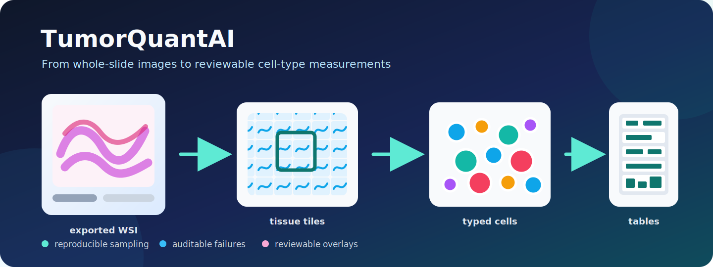

# TumorQuantAI



[](https://github.com/cfarkas/tumorquantai/actions/workflows/ci.yml)
[](https://cfarkas.github.io/tumorquantai/)
[](https://www.nextflow.io/)

TumorQuantAI turns H&E whole-slide images into cell coordinates, quality-control
overlays, cell-type counts, and cohort matrices with a reproducible Nextflow
workflow.

[Quick start](https://cfarkas.github.io/tumorquantai/QUICKSTART/) ·
[Documentation](https://cfarkas.github.io/tumorquantai/) ·
[Lymphoma tutorial](https://cfarkas.github.io/tumorquantai/TUTORIAL_LYMPHOMA_ZENODO/)

> **Research software only.** HistoPLUS predictions are not diagnoses or
> pathologist ground truth. Review image alignment, sampling, failures, and
> biological interpretation before using results.

## What TumorQuantAI does

```text
exported H&E WSI
        |
        v
 tissue-tile sampling ---- fast: a reproducible subset
        |                  full: all detected tissue tiles
        v
 HistoPLUS cell typing
        |
        +--> per-cell coordinates
        +--> QC overlays and figures
        +--> counts for each slide
        +--> cell-type × sample matrices
```

TumorQuantAI processes slides independently, retries recoverable failures,
resumes completed work, and keeps excluded samples visible in an audit table.
Optional tools create spatial reports, cohort presentations, and exploratory
clinical machine-learning analyses.

## Choose where to start

| Your goal | Start here |
| --- | --- |
| Check your computer and discover slides without inference | [Quick start](https://cfarkas.github.io/tumorquantai/QUICKSTART/) |
| Understand which TIFF is analyzed and what MPP means | [Inputs and MPP](https://cfarkas.github.io/tumorquantai/INPUTS_AND_MPP/) |
| Decide between a small test and exhaustive processing | [Fast versus full](https://cfarkas.github.io/tumorquantai/RUN_MODES/) |
| Run the lymphoma MDS tutorial (1 → 4 → 21 slides) | [Lymphoma tutorial](https://cfarkas.github.io/tumorquantai/TUTORIAL_LYMPHOMA_ZENODO/) |
| Interpret matrices and failed samples | [Outputs](https://cfarkas.github.io/tumorquantai/OUTPUT_SCHEMA/) |
| Resume or troubleshoot a run | [Running and recovery](https://cfarkas.github.io/tumorquantai/RUNNING/) |

## First safe check

Requirements: Linux, Java 17+, Nextflow, Docker, and access to the gated
[HistoPLUS model](https://huggingface.co/Owkin-Bioptimus/histoplus).

```bash
git clone https://github.com/cfarkas/tumorquantai.git
cd tumorquantai
./setup_server.sh --check
```

Arrange exported slides under one input directory:

```text
/data/slides/
├── case_001/
│   ├── 1_L0_rgb.tif   # primary image analyzed
│   └── 1_L2_rgb.tif   # companion used by sampled reports
└── case_002/
    ├── 1_L0_rgb.tif
    └── 1_L2_rgb.tif
```

Discover inputs before spending GPU time:

```bash
./run.sh \
  --input-dir /data/slides \
  --output-dir /data/tumorquant-discovery \
  --dry-run
```

Then follow the [Quick start](https://cfarkas.github.io/tumorquantai/QUICKSTART/)
to store the model token securely, verify the slide's physical resolution, and
run one slide at 1%.

## Fast or full?

| Mode | Processes | Use it for |
| --- | --- | --- |
| `--fast` | A seeded percentage of tissue tiles; 10% by default | Smoke tests, iteration, and exploratory cohort composition |
| `--full` | 100% of detected tissue tiles | Final exhaustive processing when compute and storage allow |

A 10% result is not a whole-slide cell count. Compare composition using the
fraction matrix and keep fast and full runs in different output directories.

## Start with these outputs

| File | Meaning |
| --- | --- |
| `aggregated_celltypes/celltype_counts_by_sample.csv` | Cell types as rows and samples as columns |
| `aggregated_celltypes/celltype_fractions_by_sample.csv` | Per-sample cell-type composition |
| `aggregated_celltypes/sample_aggregation_audit.csv` | Included, failed, and incomplete samples |
| `<sample>/cell_types/class_counts.csv` | Counts for one completed slide |
| `<sample>/overlays/overview_with_zoom_box.png` | Visual quality-control overview |
| `<sample>/summary/summary.json` | Sampling, provenance, and completion metadata |

An absent class in a completed slide is zero. A failed or incomplete slide is
excluded from numeric matrices and retained in the audit; it is never silently
converted into a biological zero.

## Documentation

- [Installation](https://cfarkas.github.io/tumorquantai/INSTALL/)
- [Quick start](https://cfarkas.github.io/tumorquantai/QUICKSTART/)
- [Inputs, L0/L2, and MPP](https://cfarkas.github.io/tumorquantai/INPUTS_AND_MPP/)
- [Fast versus full](https://cfarkas.github.io/tumorquantai/RUN_MODES/)
- [Running, resume, and failures](https://cfarkas.github.io/tumorquantai/RUNNING/)
- [Output schema](https://cfarkas.github.io/tumorquantai/OUTPUT_SCHEMA/)
- [Tools and reports](https://cfarkas.github.io/tumorquantai/TOOLS/)
- [Clinical machine learning](https://cfarkas.github.io/tumorquantai/CLINICAL_ML/)
- [Lymphoma tutorial](https://cfarkas.github.io/tumorquantai/TUTORIAL_LYMPHOMA_ZENODO/)
- [Glossary](https://cfarkas.github.io/tumorquantai/GLOSSARY/)

The lymphoma teaching dataset is still pre-publication. Code, documentation,
and local one-slide/four-slide validation are available; the public WSI record is not
claimed until governance, privacy review, metadata, license, and Zenodo
publication are complete.

## Citation and license

See [CITATION.cff](CITATION.cff) and cite LazySlide and HistoPLUS as appropriate.
This repository does not yet declare an open-source license; reuse permission
must not be inferred until the owner selects one.
