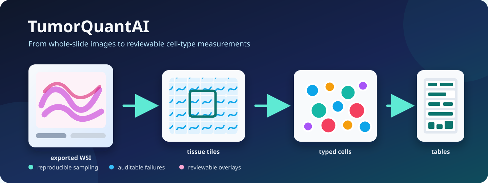

# TumorQuantAI



[](https://github.com/cfarkas/tumorquantai/actions/workflows/ci.yml)
[](https://cfarkas.github.io/tumorquantai/)
[](https://github.com/cfarkas/tumorquantai/releases/latest)
[](LICENSE)
[](https://doi.org/10.5281/zenodo.21466410)
[](https://doi.org/10.5281/zenodo.21797920)

TumorQuantAI analyzes H&E whole-slide images (WSIs) and brightfield breast-IHC
patches. The WSI route validates physical scale, samples tissue reproducibly,
runs HistoPLUS, and writes cell-type outputs. The package-native IHC route
segments and quantifies ER, PR, HER2, and Ki-67 with reviewable QC.

Version 1.0.0 is distributed as a GitHub source release. It does not publish a
standalone PyPI workflow package, a new TumorQuantAI application container, or
model weights; scientific execution uses separately published runtime images
at immutable digests. See the
[v1.0.0 release notes](docs/maintainers/RELEASE_NOTES_1.0.0.md) for scope,
compatibility, validation boundaries, and research-use limitations.

TumorQuantAI repository code and documentation are licensed under the
[MIT License](LICENSE). Third-party dependencies, runtime image contents,
HistoPLUS code/weights, and public datasets retain their separate licenses or
terms.

```text
H&E WSI -> validated scale -> tissue tiles -> HistoPLUS -> overlays + coordinates + cohort tables
IHC TIFFs -> decoded-RGB verification -> color-checked H–DAB + segmentation -> marker tables + QC + agreement
```

## Install the `tumorquantai` command

Clone the repository, enter it, and choose one installation method. The installer creates the managed command under `~/.local/bin`, installs pinned Nextflow when needed, and checks the selected runtime.

```bash
# Clone TumorQuantAI and enter the repository.
git clone https://github.com/cfarkas/tumorquantai.git
cd tumorquantai

# Install the command and prepare the Docker route.
./tumorquantai install --docker

# Make the installed command available in this terminal.
export PATH="$HOME/.local/bin:$PATH"

# Confirm that the command is available.
tumorquantai --version
```

Choose only one installation command:

```bash
# Installation and execution through Docker.
./tumorquantai install --docker

# Installation and execution through Singularity or Apptainer.
./tumorquantai install --singularity

# Installation through Poetry; Docker is the default scientific backend.
./tumorquantai install --poetry

# Installation and execution through Conda.
./tumorquantai install --conda
```

For a system-wide command, use `sudo ./tumorquantai install --docker --system` or replace `--docker` with the selected method. Do not create another tutorial virtual environment after this installation.

## Configure HistoPLUS access from Hugging Face

HistoPLUS is gated. First open the [HistoPLUS model page](https://huggingface.co/Owkin-Bioptimus/histoplus), sign in, and request access. After access is approved, create a Hugging Face token with **Read** permission and save it in the default private file:

```bash
# Create the private TumorQuantAI configuration directory.
install -d -m 700 "$HOME/.config/tumorquantai"

# Paste the Hugging Face read token without displaying it on screen.
read -rsp "Hugging Face read token: " HF_READ_TOKEN
printf '\n'
printf '%s' "$HF_READ_TOKEN" > "$HOME/.config/tumorquantai/hf_token"
unset HF_READ_TOKEN
chmod 600 "$HOME/.config/tumorquantai/hf_token"

# Check the installed runtime and the configured credential file.
tumorquantai doctor --online
```

TumorQuantAI automatically reads `$HOME/.config/tumorquantai/hf_token`; no environment variable is required. Creating a token does not grant access by itself—the Hugging Face model-access request must also be approved. The first authorized inference confirms that the pinned model artifact can be downloaded. Never paste the token into a command, issue, log, or repository file.

## QuickStart Example 1: one public WSI

No output path needs to be edited. The default directory is created beside the repository as `tumorquantai-quickstart-one-wsi`.

```bash
# Preview the fixed one-slide plan without downloading anything.
tumorquantai quickstart --dry-run

# Download, verify, convert, and inspect sample 022 without HistoPLUS inference.
tumorquantai quickstart --no-inference

# Verify the public download, L0/L2 conversion, and model-free inspection.
python3 examples/quickstart/verify_outputs.py --preparation-only
```

After HistoPLUS access is configured, run the same one-slide 1% analysis through the installed route:

```bash
# Run through the backend selected during installation.
tumorquantai quickstart --cpu

# Verify the overlay, summary, coordinates, class counts, and aggregation audit.
python3 examples/quickstart/verify_outputs.py
```

The command downloads only `TumorQuantAI_LymphomaWSI_022` from Zenodo record `21466410`, verifies its published size and checksums, converts L0 and L2, and writes `START_HERE.html`.

See the [complete one-WSI QuickStart](https://cfarkas.github.io/tumorquantai/quick_start/) for sample identity, checksums, output review, and resume behavior.

## Full tutorial: 21 public lymphoma WSIs at 10%

The [full tutorial](https://cfarkas.github.io/tumorquantai/full_tutorial/) starts with `git clone` and `cd tumorquantai`, uses fixed relative tutorial directories, downloads all 21 public lymphoma MDS files, validates every SHA-256 checksum, converts L0/L2 with the installed `tumorquantai convert` command, and processes a deterministic 10% of detected tissue tiles per slide.

## Breast IHC: marker quantification and optional cell typing

The package-native route reads extracted TIFFs or published case ZIPs directly
and quantifies every selected ER, PR, HER2, and Ki-67 patch. It does not require
HistoPLUS model access:

```bash
# Quantify every published IHC patch and keep per-cell audit tables.
tumorquantai ihc quantify /path/to/breast-ihc-downloads \
  --manifest /path/to/manifest/patch_manifest.csv \
  --output /path/to/breast-ihc-marker-results \
  --workers 12 \
  --save-cells
```

Open <code>START_HERE.html</code> to review the cohort table and segmentation
overlays. The clear wide result is
<code>tables/tumorquantai_marker_values.csv</code>; v2 reports color-checked
values and keeps unconstrained HED percentages as explicit audit columns. An
exact private alias linkage can then drive the privacy-minimized pathologist
CSV and marker-wise
kappa workflow through <code>tumorquantai ihc anonymize-clinical</code> and
<code>tumorquantai ihc compare</code>. The comparison writes a visual report,
<code>concordance_metrics.csv</code> with the complete aggregate metrics, and
wide and long paired case CSVs. Those case-level outputs are pseudonymized
health data, not irreversibly anonymous data.
The [case-linkage and privacy reference](docs/reference/breast-ihc-case-linkage.md)
documents exactly how source `case_id`, workbook `Biopsia`, and public aliases
relate, including the 51-case audit and the files that must never enter Git.

For optional HistoPLUS cell typing, the established patch route accepts
authorized local raw TIFFs, processes every discovered patch without
percentage subsampling, and can write paper-ready and QC figures. Use reliable
TIFF-embedded physical pixel size:

```bash
# Process every local TIFF patch on CPU and request paper/QC figures.
tumorquantai --patches /path/to/breast-ihc-tiff-patches \
  --paper-figures \
  --output /path/to/breast-ihc-patch-results \
  --cpu
```

For each completed input, `celltypes_paper_figure.png` and `.pdf` use a
full-width compact layout inspired by the visual grammar of
[STTT 2026 Figure 6](https://www.nature.com/articles/s41392-026-02734-0#Fig6)
and [Figure 7](https://www.nature.com/articles/s41392-026-02734-0#Fig7): panel
**a** reports every detected HistoPLUS cell type as a count and
within-input percentage, panel **b** shows the scale-calibrated overview and
ROI, and panel **c** shows the enlarged QC inset with the configured cell-type
overlay. The sample ID, panel
explanations, count source and denominator, scale/ROI/model provenance, and
research-use caveats are kept outside the artwork in
`celltypes_paper_figure_legend.txt`.

For outputs whose completion summary records the current paper-layout version,
the legend is required for completion and resume reuse. The layout version is
separate from the scientific worker processing signature: direct reuse of the
same persistent worker output preserves the earlier contract for a legacy
completed output without a layout version. Standard `tumorquantai` execution is
orchestrated by Nextflow, however, and its cache also keys staged worker code
and configuration. A software upgrade can therefore invalidate `PROCESS_SLIDE`
and re-enter HistoPLUS inference even when the worker signature is unchanged.
Before resuming, run the intended command with `--dry-run` and verify that its
expanded engine command uses `-resume` and the original work directory. If
exact software/work-cache reuse is uncertain, select `--cpu` to avoid NVIDIA
GPU contention. To obtain redesigned figures for a legacy result, choose a new
output directory or a deliberate rerun.

This stable patch route reports HistoPLUS cell-type predictions from each TIFF.
It does not score ER, PR, HER2, or Ki-67 staining; infer receptor status; or
establish co-expression across separately stained patches. The layout
inspiration does not import any external biological result or performance
claim.

Consult the [Nature Research figure
specifications](https://research-figure-guide.nature.com/figures/preparing-figures-our-specifications/)
when preparing final submission files; TumorQuantAI exports do not by themselves
guarantee compliance with a particular journal's production requirements.

If the TIFFs do not contain reliable micrometres-per-pixel metadata, provide one
verified common value with `--source-mpp`. Do not copy an MPP from another
scanner, objective, or export. The public, raw-only example dataset is available
from [Zenodo record 21797920](https://zenodo.org/records/21797920) under CC BY
4.0, with dataset DOI
[`10.5281/zenodo.21797920`](https://doi.org/10.5281/zenodo.21797920). Its 55
files comprise 51 case archives containing 1,901 TIFF patches plus four
auxiliary files: one manifest bundle, one packaging report, and two checksum
rosters (74,958,557,152 bytes total). Generated paper and QC figures are local
workflow outputs and are not part of the Zenodo deposit. This
DOI identifies the breast-IHC dataset, not the TumorQuantAI software or the
separate lymphoma dataset. See the [breast IHC patch tutorial](https://cfarkas.github.io/tumorquantai/tutorials/breast-ihc-patches/).

## Colon IHC: direct Motic WSI quantification

TumorQuantAI can read Motic MDS pixel pyramids directly and quantify registered
CD3/CD8 serial sections in CK20-guided epithelial and stromal proxy
compartments:

~~~bash
tumorquantai --inmunoscore /private/extracted/inmunoscore \
  --output /controlled/results/tumorquantai_immunoscore \
  --alias-secret-file /controlled/private_release/alias_secret.bin \
  --private-linkage /controlled/private_release/case_slide_linkage.csv \
  --workers 3
~~~

The command writes one clear case-value CSV, an explicit pass-only/all-numeric
cohort summary, a long counts/areas/densities CSV, registration metrics,
composite QC images, 300-dpi case/slide review sheets, a provisional pI0-pI4
within-cohort analogue, and an offline pathologist accept/flag/exclude dashboard.
The pI label is a CK20-guided research proxy, not the consensus clinical
Immunoscore: the official field remains blank without pathologist-validated
tumour-core/invasive-margin regions and the validated external reference
distribution. Reviewer decisions are additive and never overwrite the
algorithm values or automatic QC. See the [colon IHC whole-slide
tutorial](https://cfarkas.github.io/tumorquantai/tutorials/colon-ihc-wsi-immunoscore/).

## Run your own WSIs

Use one L0 TIFF and, for sampled analyses, one L2 companion per sample:

```text
slides/
└── case_001/
    ├── 1_L0_rgb.tif
    └── 1_L2_rgb.tif
```

```bash
# Inspect your own slides without running HistoPLUS.
tumorquantai inspect /path/to/slides \
  --output /path/to/tumorquantai-inspection \
  --source-mpp 0.261780

# Run a reproducible 10% analysis after reviewing the inspection.
tumorquantai run /path/to/slides \
  --output /path/to/tumorquantai-results \
  --preset fast \
  --source-mpp 0.261780 \
  --cpu
```

Use the physical MPP recorded by the scanner or export software.

## Inspect these outputs first

| Path | Purpose |
| --- | --- |
| `START_HERE.html` | Run status and links to outputs that exist |
| `<sample>/overlays/celltypes_overview_and_zoom.png` | Visual alignment and cell-type overlay QC |
| `<sample>/paper_figures/celltypes_paper_figure.png` | Compact cell-type statistics, overview, and configured-overlay QC inset |
| `<sample>/paper_figures/celltypes_paper_figure_legend.txt` | Sample-specific figure legend and interpretation boundaries |
| `<sample>/summary/summary.json` | Completion, scale, sampling, seed, model, and provenance |
| `<sample>/cell_types/class_counts.csv` | Detected-cell counts in processed tissue tiles |
| `aggregated_celltypes/sample_aggregation_audit.csv` | Included, failed, incomplete, and excluded samples |
| `aggregated_celltypes/celltype_fractions_by_sample.csv` | Within-sample cell-type fractions |

A zero is interpretable only for a completed sample. Failed or incomplete samples do not become all-zero columns.

## Documentation

- [Installation](https://cfarkas.github.io/tumorquantai/installation/)
- [HistoPLUS access](https://cfarkas.github.io/tumorquantai/how-to/model-access/)
- [QuickStart Example 1](https://cfarkas.github.io/tumorquantai/quick_start/)
- [Execution methods](https://cfarkas.github.io/tumorquantai/execution_environments/)
- [Full 21-slide tutorial](https://cfarkas.github.io/tumorquantai/full_tutorial/)
- [Breast IHC TIFF patches at 100%](https://cfarkas.github.io/tumorquantai/tutorials/breast-ihc-patches/)
- [Apply to your own WSIs](https://cfarkas.github.io/tumorquantai/own_data/)
- [Outputs](https://cfarkas.github.io/tumorquantai/outputs/)
- [Troubleshooting](https://cfarkas.github.io/tumorquantai/troubleshooting/)
