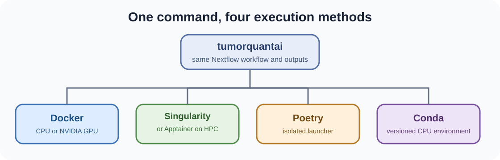

# Execution methods

TumorQuantAI exposes one installed command and four supported ways to prepare or execute the workflow.



## Docker

```bash
# Install and select Docker as the default backend.
./tumorquantai install --docker
export PATH="$HOME/.local/bin:$PATH"

# Run an analysis explicitly through Docker.
tumorquantai run /path/to/slides \
  --output /path/to/results \
  --preset fast \
  --source-mpp 0.261780 \
  --docker \
  --cpu
```

## Singularity or Apptainer

```bash
# Install and select Singularity or Apptainer as the default backend.
./tumorquantai install --singularity
export PATH="$HOME/.local/bin:$PATH"

# Run an analysis explicitly through Singularity or Apptainer.
tumorquantai run /path/to/slides \
  --output /path/to/results \
  --preset fast \
  --source-mpp 0.261780 \
  --singularity \
  --cpu
```

## Poetry

```bash
# Install the Poetry-managed launcher.
./tumorquantai install --poetry
export PATH="$HOME/.local/bin:$PATH"

# Run through Poetry with Docker as the scientific backend.
poetry run tumorquantai run /path/to/slides \
  --output /path/to/results \
  --preset fast \
  --source-mpp 0.261780 \
  --docker \
  --cpu
```

The global `tumorquantai` command installed by the same operation can be used instead of `poetry run tumorquantai`.

## Conda

```bash
# Install and select Conda as the default backend.
./tumorquantai install --conda
export PATH="$HOME/.local/bin:$PATH"

# Run through the versioned Conda environment.
tumorquantai run /path/to/slides \
  --output /path/to/results \
  --preset fast \
  --source-mpp 0.261780 \
  --conda \
  --cpu
```

The versioned Conda route is CPU-only. Use Docker or Singularity/Apptainer for GPU execution.

## Override the installed default

The installer stores the selected default backend. Any run can override it with exactly one of:

```text
--docker
--singularity
--conda
--backend docker|singularity|conda|local
```

Keep separate output and work directories when comparing routes. Do not reuse one Nextflow work directory across different backends.
