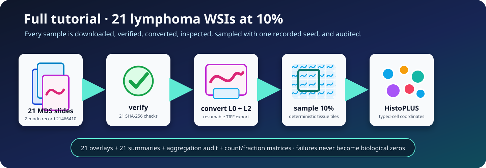

<a id="full-tutorial"></a>

# Full tutorial: 21 public lymphoma WSIs at 10%

This tutorial downloads the complete 21-slide public lymphoma collection from Zenodo, validates every MDS file, converts L0 and L2, inspects the exact roster, runs HistoPLUS on a deterministic **10%** of detected tissue tiles from each slide, and verifies the per-slide and cohort outputs.



!!! warning "Research use only"
    The public slides have no diagnostic annotations or pathologist ground truth. This tutorial validates software execution and reproducible sampling, not clinical performance.

## Dataset and resource scope

| Item | Value |
| --- | --- |
| Zenodo record | `21466410` |
| Dataset DOI | `10.5281/zenodo.21466410` |
| Public MDS files | 21 |
| Compressed download | `17370771968` bytes, about 16.2 GiB |
| Source MPP | `0.261780` µm/pixel |
| Converted levels | L0 and L2 |
| Analysis preset | `fast` |
| Tissue sampling | Seeded 10% per slide |

L0/L2 conversion can approach 142 GB. Budget at least **300 GB** for downloads, conversion, work, caches, and final results. GPU execution is recommended for the 21-slide inference stage.

Complete [QuickStart Example 1](quick_start.md) first. Review its inspection report, overlay, summary, and aggregation audit before scaling to 21 slides.

## 1. Clone TumorQuantAI

```bash
# Clone TumorQuantAI and enter the repository.
git clone https://github.com/cfarkas/tumorquantai.git
cd tumorquantai
```

## 2. Install the tutorial environment

```bash
# Create and activate the tutorial environment.
python3 -m venv .venv
. .venv/bin/activate

# Install the download and conversion requirements.
python -m pip install --upgrade pip
python -m pip install -r requirements-tutorial.txt
```

## 3. Set and verify the storage root

Edit only the first path:

```bash
# Set the only path that must be changed and remember the repository root.
export TQA_ROOT=/path/to/mounted/storage/tumorquantai-lymphoma-21
REPO_ROOT="$(pwd)"

# Create and verify the selected storage directory.
mkdir -p "$TQA_ROOT"
findmnt -T "$TQA_ROOT"
df -hT "$TQA_ROOT"
test -w "$TQA_ROOT"
```

Do not place the collection, converted TIFFs, model cache, Nextflow work, or results inside the Git checkout, `/`, or an unverified home filesystem.

## 4. Download the authoritative manifest

```bash
# Download or resume the public dataset manifest.
wget --continue \
  --output-document "$TQA_ROOT/tumorquantai_lymphoma_mds_manifest.csv" \
  "https://zenodo.org/records/21466410/files/tumorquantai_lymphoma_mds_manifest.csv?download=1"

# Verify the fixed public manifest MD5.
echo "ad9a9472e8beb302f8b9ba2b3359bacc  $TQA_ROOT/tumorquantai_lymphoma_mds_manifest.csv" \
  | md5sum -c -
```

## 5. Download all 21 public MDS files

The repository URL list is generated from the authoritative manifest and preserves the standard `TumorQuantAI_LymphomaWSI_NNN.mds` filenames.

```bash
# Download or resume all 21 public MDS files.
while IFS= read -r url; do
  filename="${url##*/}"
  filename="${filename%%\?*}"
  wget --continue \
    --output-document "$TQA_ROOT/$filename" \
    "$url"
done < examples/lymphoma/zenodo_all_21.urls.txt
```

Use this equivalent curl loop when `wget` is unavailable:

```bash
# Download or resume all 21 public MDS files with curl.
while IFS= read -r url; do
  filename="${url##*/}"
  filename="${filename%%\?*}"
  curl --fail --location --retry 5 --continue-at - \
    --output "$TQA_ROOT/$filename" \
    "$url"
done < examples/lymphoma/zenodo_all_21.urls.txt
```

## 6. Verify all 21 downloads

```bash
# Validate every slide checksum without changing the parent shell directory.
(
  cd "$TQA_ROOT"
  sha256sum -c "$REPO_ROOT/examples/lymphoma/checksums_all_21.sha256"
)

# Confirm that exactly 21 standard MDS filenames are present.
find "$TQA_ROOT" -maxdepth 1 -type f \
  -name 'TumorQuantAI_LymphomaWSI_*.mds' \
  -printf '%f\n' \
  | sort \
  | tee "$TQA_ROOT/downloaded_slides.txt"
test "$(wc -l < "$TQA_ROOT/downloaded_slides.txt")" -eq 21
```

`sha256sum` must print `OK` 21 times. Stop before conversion if any file fails.

## 7. Convert L0 and L2

```bash
# Convert all verified MDS files to resumable L0 and L2 TIFFs.
python bin/mds_to_tiff.py \
  --input "$TQA_ROOT" \
  --manifest "$TQA_ROOT/tumorquantai_lymphoma_mds_manifest.csv" \
  --output-dir "$TQA_ROOT/slides" \
  --levels 0 2 \
  --expected-count 21 \
  --source-mpp 0.261780 \
  --resume
```

The converter validates the selected MDS files against the manifest before writing TIFFs. Repeat the same command to resume an interrupted conversion.

## 8. Inspect the exact 21-slide roster

```bash
# Inspect all converted L0/L2 pairs without HistoPLUS inference.
tumorquantai inspect "$TQA_ROOT/slides" \
  --sample-sheet "$TQA_ROOT/slides/samples.csv" \
  --output "$TQA_ROOT/inspection"

# Confirm that the inspection manifest has 21 sample rows.
python - <<'PY'
import csv
from pathlib import Path
import os

root = Path(os.environ["TQA_ROOT"])
manifest = root / "inspection/inspection_manifest.csv"
with manifest.open(newline="", encoding="utf-8") as handle:
    rows = list(csv.DictReader(handle))
assert len(rows) == 21, f"Expected 21 inspected slides, found {len(rows)}"
print("PASS: 21 slides were inspected")
PY
```

Open `$TQA_ROOT/inspection/INSPECTION.html`. Require exactly 21 unique primary L0 slides, 21 L2 companions, and source MPP `0.261780`. Stop if the roster or physical scale differs.

## 9. Check inference readiness

```bash
# Check Java, Nextflow, Docker, storage, and configured model access.
tumorquantai doctor \
  --input "$TQA_ROOT/slides" \
  --output "$TQA_ROOT/results-10-percent" \
  --work-dir "$TQA_ROOT/work-10-percent" \
  --online
```

Follow [Configure authorized HistoPLUS access](how-to/model-access.md) when model access is not ready. Never place a token value directly in the command.

## 10. Run all 21 slides at 10%

The `fast` preset selects a deterministic 10% of detected tissue tiles from every slide. GPU execution is recommended:

```bash
# Run all 21 slides at a deterministic 10% with the GPU profile.
tumorquantai run "$TQA_ROOT/slides" \
  --sample-sheet "$TQA_ROOT/slides/samples.csv" \
  --output "$TQA_ROOT/results-10-percent" \
  --work-dir "$TQA_ROOT/work-10-percent" \
  --preset fast \
  --source-mpp 0.261780 \
  --gpu
```

Use the following CPU command only when a much longer run is acceptable:

```bash
# Run the same 10% analysis with the CPU profile.
tumorquantai run "$TQA_ROOT/slides" \
  --sample-sheet "$TQA_ROOT/slides/samples.csv" \
  --output "$TQA_ROOT/results-10-percent-cpu" \
  --work-dir "$TQA_ROOT/work-10-percent-cpu" \
  --preset fast \
  --source-mpp 0.261780 \
  --cpu
```

Use separate output and work directories when comparing CPU and GPU runs. Do not mix different presets, seeds, profiles, or source MPP values in one output root.

## 11. Monitor and resume

```bash
# Summarize completed, failed, incomplete, and pending slides.
tumorquantai status "$TQA_ROOT/results-10-percent"
```

Press **Ctrl+C** to stop. Repeat the identical run command with the same output and work directories. Resume is enabled by default and reuses valid Nextflow tasks.

## 12. Verify the 21-slide outputs

```bash
# Verify the exact 21-slide 10% result set.
python3 examples/lymphoma/verify_fast21_outputs.py \
  --output "$TQA_ROOT/results-10-percent"
```

A successful verifier ends with:

```text
SUCCESS: 21-slide TumorQuantAI 10% tutorial outputs are complete.
```

The verifier requires:

- 21 included samples in `sample_aggregation_audit.csv`;
- no failed, incomplete, pending, or excluded samples;
- one nonempty overlay, summary, and class-count table per slide;
- `sampling_percent` or equivalent summary metadata equal to 10;
- nonempty cohort count and fraction matrices.

## 13. Review the results


Review:

1. `$TQA_ROOT/results-10-percent/START_HERE.html`
2. all 21 `overlays/celltypes_overview_and_zoom.png` files
3. all 21 `summary/summary.json` files
4. `aggregated_celltypes/sample_aggregation_audit.csv`
5. `aggregated_celltypes/celltype_counts_by_sample.csv`
6. `aggregated_celltypes/celltype_fractions_by_sample.csv`

Ten-percent counts describe sampled tissue tiles. They are not validated whole-slide estimates and must not be multiplied by ten.

## 14. Preserve provenance

Keep:

- the authoritative manifest;
- `examples/lymphoma/zenodo_all_21.urls.txt` and `checksums_all_21.sha256`;
- converted `samples.csv`;
- inspection manifest and report;
- every per-slide `summary.json`;
- the aggregation audit and cohort matrices;
- the TumorQuantAI commit and run command;
- the Nextflow work directory until the result is reviewed and backed up.

## Continue

- [Output files](outputs.md)
- [Sampling and reproducibility](explanation/sampling.md)
- [Counts versus fractions](explanation/counts-fractions.md)
- [Failed sample versus biological zero](explanation/failed-vs-zero.md)
- [Troubleshooting](troubleshooting/index.md)