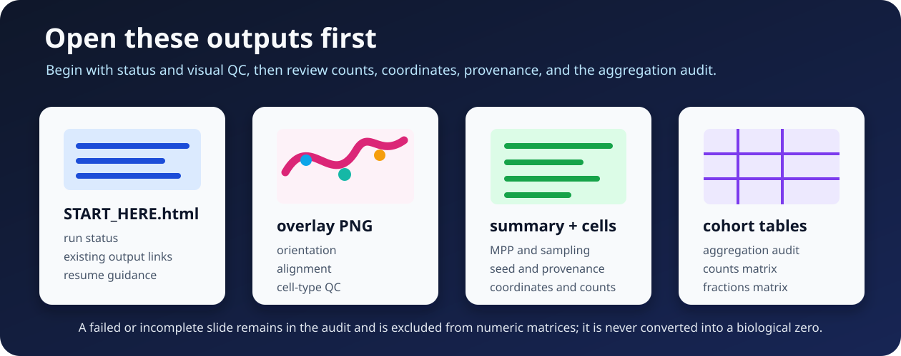

# Output files

TumorQuantAI writes one result directory per slide and aggregates only completed slides into cohort matrices.



## Main directory structure

```text
results/
├── START_HERE.html
├── tumorquantai_report.json
├── workflow_metadata/
├── <sample>/
│   ├── cell_types/
│   │   ├── class_counts.csv
│   │   └── cell_type_coordinates.csv
│   ├── overlays/
│   │   └── celltypes_overview_and_zoom.png
│   └── summary/
│       └── summary.json
└── aggregated_celltypes/
    ├── sample_aggregation_audit.csv
    ├── celltype_counts_by_sample.csv
    └── celltype_fractions_by_sample.csv
```

Additional files can appear when optional QuPath, JSON, QC-patch, collage, or cell-stage exports are enabled.

## 1. `START_HERE.html`

Open this file first. It summarizes:

- run completion state;
- included, failed, incomplete, excluded, and pending samples;
- selected preset and sampling percentage;
- links to outputs that exist;
- the local resume command when work remains.

```bash
# Regenerate the portable report when needed.
./tumorquantai report /path/to/results
```

## 2. Per-slide overlay

```text
<sample>/overlays/celltypes_overview_and_zoom.png
```

Review every overlay for:

- slide orientation;
- tissue-region selection;
- coordinate alignment;
- plausible cell-marker placement;
- artifacts, folds, blur, pen marks, or background;
- gross class-color errors.

A cohort matrix does not replace per-slide visual QC.

## 3. Per-slide summary

```text
<sample>/summary/summary.json
```

The summary records completion and provenance fields such as:

- sample ID;
- source and target MPP;
- sampling percentage;
- random seed;
- tile counts;
- detected-cell counts;
- model revision and weight identity;
- container and software identity;
- input fingerprints;
- completion status.

Inspect it with:

```bash
# Display the formatted per-slide summary.
python -m json.tool \
  /path/to/results/case_001/summary/summary.json
```

## 4. Cell coordinates

```text
<sample>/cell_types/cell_type_coordinates.csv
```

This table contains detected-cell identities, labels, centroids, bounding boxes, and related coordinate fields. Coordinates refer to the processed slide coordinate system recorded in the summary.

Do not join coordinate files to clinical data using public filenames or patient identifiers. Use controlled research sample IDs.

## 5. Per-slide class counts

```text
<sample>/cell_types/class_counts.csv
```

This table contains counts in the processed tissue tiles for one completed slide.

For sampled runs:

- 1% counts describe the selected 1% of tissue tiles;
- 10% counts describe the selected 10% of tissue tiles;
- counts are not validated whole-slide totals;
- do not multiply counts by 100 or 10.

## 6. Aggregation audit

```text
aggregated_celltypes/sample_aggregation_audit.csv
```

The audit is the first cohort file to review. It identifies samples that were:

- included;
- failed;
- incomplete;
- excluded;
- missing expected outputs.

A failed or incomplete sample is not a biological zero. It remains in the audit and is excluded from numeric matrices.

## 7. Count matrix

```text
aggregated_celltypes/celltype_counts_by_sample.csv
```

Columns correspond to completed included samples. Values are raw HistoPLUS detections in processed tissue tiles.

Compare counts only when sampling, MPP, model identity, and other relevant settings are compatible.

## 8. Fraction matrix

```text
aggregated_celltypes/celltype_fractions_by_sample.csv
```

Fractions are calculated within each completed sample from its processed-tile counts. They describe the composition of detected cells in the sampled tissue tiles.

Fractions do not correct for:

- tissue-area differences;
- slide quality;
- sampling uncertainty;
- model error;
- scanner or stain variation;
- failed or excluded samples.

## Completed zero versus failure

A class count of zero is meaningful only when the slide completed and the class was absent from the processed tiles.

| Situation | Numeric matrix column? | Interpretation |
| --- | --- | --- |
| Completed slide, one class count is zero | Yes | No detections for that class in processed tiles |
| Completed slide, total cells are zero | Yes, when valid completion is recorded | Completed biological/software zero requiring QC review |
| Failed slide | No | No valid numeric result |
| Incomplete slide | No | Resume or investigate |
| Excluded slide | No | Intentionally absent from the numeric cohort |

See [Failed sample versus biological zero](explanation/failed-vs-zero.md).

## Check a run from the terminal

```bash
# Summarize the run state.
./tumorquantai status /path/to/results

# List all required per-slide overlays.
find /path/to/results -type f \
  -path '*/overlays/celltypes_overview_and_zoom.png' \
  -print

# Display the aggregation audit.
column -s, -t \
  < /path/to/results/aggregated_celltypes/sample_aggregation_audit.csv
```

`column` is optional. Open the CSV directly when it is unavailable.

## Preserve with every analysis

Keep:

- `START_HERE.html` and `tumorquantai_report.json`;
- every per-slide summary and overlay;
- cell coordinates and class counts used in analysis;
- aggregation audit and cohort matrices;
- input/sample-sheet provenance;
- source MPP provenance;
- software commit, model revision, and container identity;
- selected preset, sampling percentage, and seed.

## Continue

- [Results gallery](gallery.md)
- [Sampling and reproducibility](explanation/sampling.md)
- [Counts versus fractions](explanation/counts-fractions.md)
- [Troubleshooting](troubleshooting/index.md)