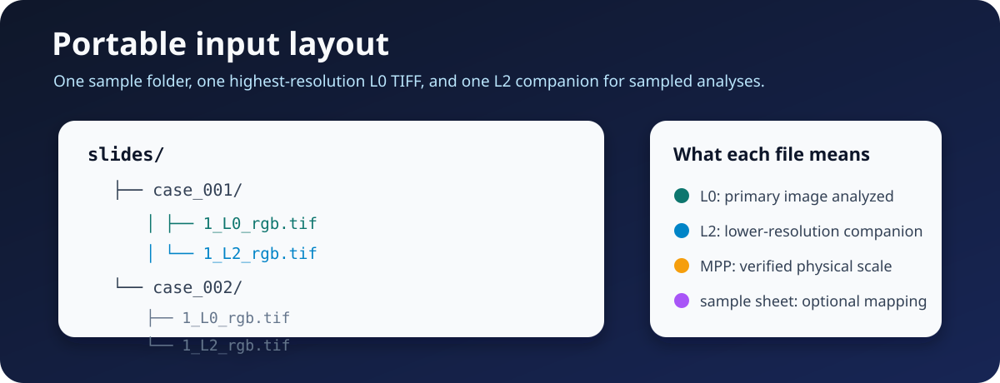
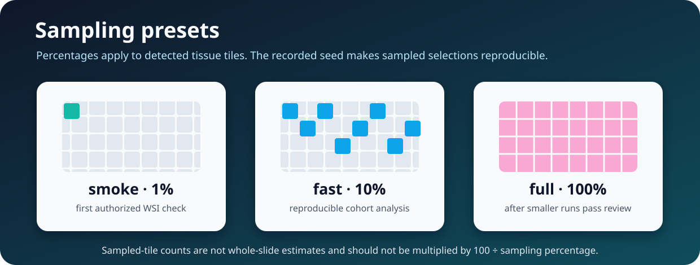

# Apply TumorQuantAI to your own WSIs

Use this guide after completing [QuickStart Example 1](quick_start.md). The first step is always model-free inspection. Do not begin HistoPLUS inference until the slide roster, L0/L2 pairing, and physical scale are reviewed.



## 1. Clone TumorQuantAI

```bash
# Clone TumorQuantAI and enter the repository.
git clone https://github.com/cfarkas/tumorquantai.git
cd tumorquantai
```

## 2. Prepare the input layout

The recommended portable layout is one folder per sample:

```text
/path/to/slides/
├── case_001/
│   ├── 1_L0_rgb.tif
│   └── 1_L2_rgb.tif
└── case_002/
    ├── 1_L0_rgb.tif
    └── 1_L2_rgb.tif
```

- **L0** is the highest-resolution primary image analyzed.
- **L2** is the lower-resolution companion required for sampled reports and collages.
- **Source MPP** is the physical pixel size of L0 in micrometres per pixel.
- **Target MPP** is the model tile scale and is a separate workflow setting.

Do not copy a source MPP from a different slide. Use scanner metadata, export provenance, or a validated manifest.

## 3. Inspect the slide folder

```bash
# Set your input and inspection paths.
TQA_INPUT=/path/to/slides
TQA_INSPECTION=/path/to/tumorquantai-inspection

# Inspect the WSI folder without running HistoPLUS.
tumorquantai inspect "$TQA_INPUT" \
  --output "$TQA_INSPECTION"
```

When source MPP is not embedded in the TIFF metadata, provide it explicitly:

```bash
# Inspect the same folder with a verified source MPP.
tumorquantai inspect "$TQA_INPUT" \
  --output "$TQA_INSPECTION" \
  --source-mpp 0.261780
```

Open `$TQA_INSPECTION/INSPECTION.html` and review:

- sample IDs;
- primary L0 paths;
- L2 companions;
- source MPP;
- duplicate warnings;
- excluded or unrecognized files.

## 4. Use a sample sheet when names need control

A sample sheet maps a stable sample ID to a primary slide path.

```csv
sample_id,slide_path
case_001,/path/to/slides/case_001/1_L0_rgb.tif
case_002,/path/to/slides/case_002/1_L0_rgb.tif
```

Create it with a copy/paste command:

```bash
# Create a two-sample input manifest.
cat > /path/to/slides/samples.csv <<'CSV'
sample_id,slide_path
case_001,/path/to/slides/case_001/1_L0_rgb.tif
case_002,/path/to/slides/case_002/1_L0_rgb.tif
CSV

# Inspect only the samples in the manifest.
tumorquantai inspect /path/to/slides \
  --sample-sheet /path/to/slides/samples.csv \
  --output /path/to/tumorquantai-inspection \
  --source-mpp 0.261780
```

Use non-identifying research sample IDs. Do not place protected health information in filenames, sample sheets, or public bug reports.

## 5. Choose a preset



| Preset | Tissue tiles | Use |
| --- | ---: | --- |
| `smoke` | Seeded 1% from one selected slide | First authorized inference check |
| `fast` | Seeded 10% | Exploratory multi-slide analysis |
| `full` | 100% | Exhaustive processing after smaller runs pass review |

For a new cohort, begin with one slide at 1%, review the overlay and MPP, then use 10% across the cohort.

## 6. Check inference readiness

```bash
# Check the intended input, output, and work locations.
tumorquantai doctor \
  --input /path/to/slides \
  --output /path/to/tumorquantai-results \
  --work-dir /path/to/tumorquantai-work \
  --online
```

Follow [Configure authorized HistoPLUS access](how-to/model-access.md) when the model is not ready.

## 7. Run one slide at 1%

```bash
# Run one selected sample at a deterministic 1% on CPU.
tumorquantai run /path/to/slides \
  --sample-sheet /path/to/slides/samples.csv \
  --output /path/to/tumorquantai-smoke \
  --work-dir /path/to/tumorquantai-work-smoke \
  --preset smoke \
  --sample case_001 \
  --source-mpp 0.261780 \
  --cpu
```

Review the overlay, summary, class counts, and audit before scaling.

## 8. Run the cohort at 10%

```bash
# Run all manifest samples at a deterministic 10% with the GPU profile.
tumorquantai run /path/to/slides \
  --sample-sheet /path/to/slides/samples.csv \
  --output /path/to/tumorquantai-results-10-percent \
  --work-dir /path/to/tumorquantai-work-10-percent \
  --preset fast \
  --source-mpp 0.261780 \
  --gpu
```

Use `--cpu` instead of `--gpu` when GPU execution is unavailable. Keep different output and work directories for different presets, seeds, profiles, or MPP values.

## 9. Monitor and resume

```bash
# Summarize completed, failed, incomplete, excluded, and pending samples.
tumorquantai status /path/to/tumorquantai-results-10-percent
```

Press **Ctrl+C** to stop. Repeat the exact run command to resume. Do not move or delete the active work directory.

## 10. Review the outputs


```bash
# Regenerate the portable report after the workflow finishes.
tumorquantai report /path/to/tumorquantai-results-10-percent
```

Review:

1. `START_HERE.html`
2. every per-slide overlay
3. every per-slide summary
4. `sample_aggregation_audit.csv`
5. cohort count and fraction matrices

Counts from sampled runs describe processed tissue tiles and are not validated whole-slide estimates.

## Advanced selection

Use `--include` and `--exclude` for stable sample-ID globs:

```bash
# Run only sample IDs beginning with cohort_A and exclude repeat samples.
tumorquantai run /path/to/slides \
  --sample-sheet /path/to/slides/samples.csv \
  --output /path/to/tumorquantai-cohort-A \
  --work-dir /path/to/tumorquantai-work-cohort-A \
  --preset fast \
  --source-mpp 0.261780 \
  --include 'cohort_A*' \
  --exclude '*repeat*' \
  --cpu
```

## Continue

- [Input files and MPP](inputs.md)
- [Running, presets, and resume](running.md)
- [Output files](outputs.md)
- [Troubleshooting](troubleshooting/index.md)