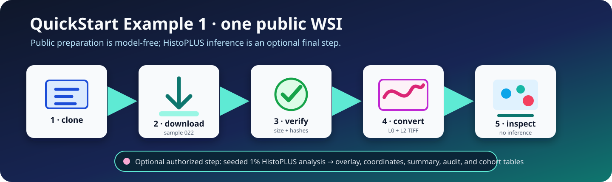

<a id="quick-start"></a>

# QuickStart Example 1: one public WSI

This tutorial downloads one public lymphoma WSI, validates its identity, converts Motic MDS levels L0 and L2 to TIFF, inspects the slide, and optionally runs a deterministic 1% HistoPLUS analysis.



## Fixed public sample

| Item | Value |
| --- | --- |
| Zenodo record | `21466410` |
| Sample | `TumorQuantAI_LymphomaWSI_022` |
| Download size | `125350400` bytes |
| MD5 | `94bb5b08ccf1957f8c42a579e8b33cfb` |
| SHA-256 | `db2988b5c6bc791510cec4127106509e604e577feafdb15b94c149043ed7067a` |
| Source MPP | `0.261780` µm/pixel |
| Converted levels | L0 and L2 |
| Optional inference | Seeded 1% of detected tissue tiles |

Public download and preparation need no Zenodo credential. HistoPLUS access is required only for inference.

## 1. Clone and install

Choose one installation command. Docker is shown first.

```bash
# Clone TumorQuantAI and enter the repository.
git clone https://github.com/cfarkas/tumorquantai.git
cd tumorquantai

# Install the command and Docker route.
./tumorquantai install --docker

# Make the installed command available in this terminal.
export PATH="$HOME/.local/bin:$PATH"
```

Alternative installation commands are:

```bash
# Install for Singularity or Apptainer.
./tumorquantai install --singularity

# Install through Poetry; Docker is the default scientific backend.
./tumorquantai install --poetry

# Install for Conda.
./tumorquantai install --conda
```

Run only the command for the route you will use.

## 2. Preview the plan

```bash
# Print the bounded one-slide plan without downloading.
tumorquantai quickstart --dry-run
```

The default directory is `.tumorquantai-quickstart-one-wsi`, beside the cloned repository. The command prints its resolved location. Use `--output /another/directory` only when a different filesystem is needed.

## 3. Download, verify, convert, and inspect

```bash
# Prepare sample 022 without running HistoPLUS.
tumorquantai quickstart --no-inference
```

This single command downloads the authoritative manifest and sample 022, verifies size, MD5, and SHA-256, converts L0/L2 with resumable state, writes `samples.csv`, performs model-free inspection, and creates `START_HERE.html`.

## 4. Verify the preparation

```bash
# Verify the default QuickStart directory.
python3 examples/quickstart/verify_outputs.py --preparation-only
```

Open first:

```text
.tumorquantai-quickstart-one-wsi/START_HERE.html
```

## 5. Configure HistoPLUS access

Follow [Configure authorized HistoPLUS access](how-to/model-access.md). Never place a token value on the command line or commit a model weight.

```bash
# Recheck the computer and authorized model-access path.
tumorquantai doctor --online
```

## 6. Run the one-slide 1% analysis

Choose one execution command:

### Docker

```bash
# Run QuickStart #1 through Docker on CPU.
tumorquantai quickstart --docker --cpu
```

### Singularity or Apptainer

```bash
# Run QuickStart #1 through Singularity or Apptainer on CPU.
tumorquantai quickstart --singularity --cpu
```

### Poetry

```bash
# Run from the Poetry environment with Docker.
poetry run tumorquantai quickstart --docker --cpu
```

The global command installed by `./tumorquantai install --poetry` is equivalent:

```bash
# Run the Poetry-installed global command with Docker.
tumorquantai quickstart --docker --cpu
```

### Conda

```bash
# Run QuickStart #1 through the versioned Conda environment.
tumorquantai quickstart --conda --cpu
```

Use a GPU only after the selected container runtime and NVIDIA device pass `tumorquantai doctor`.

## 7. Verify inference outputs

```bash
# Verify the overlay, summary, coordinates, counts, and audit.
python3 examples/quickstart/verify_outputs.py
```

Review in this order:

1. `.tumorquantai-quickstart-one-wsi/START_HERE.html`
2. the one-slide cell-type overlay;
3. `summary.json`;
4. `class_counts.csv` and cell coordinates;
5. `sample_aggregation_audit.csv`.

The counts describe the selected 1% of detected tissue tiles. Do not multiply them by 100.

## Stop and resume

Press **Ctrl+C** to stop. Repeat the same command. Verified downloads, converted TIFFs, and valid Nextflow tasks are reused.

```bash
# Download and verify only.
tumorquantai quickstart --download-only

# Convert an already verified download.
tumorquantai quickstart --convert-only

# Regenerate preparation and inspection without inference.
tumorquantai quickstart --no-inference
```

## Continue

- [Full tutorial: all 21 lymphoma WSIs at 10%](full_tutorial.md)
- [Apply TumorQuantAI to your own WSIs](own_data.md)
- [Output files](outputs.md)
