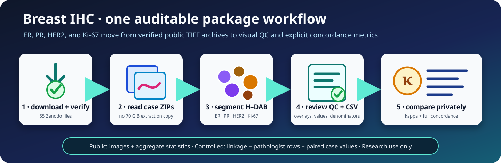

# Breast IHC quantification

<div class="tqa-ihc-banner" markdown>
<span class="tqa-kicker">PUBLIC 51-CASE WORKFLOW</span>

## Measure ER, PR, HER2, and Ki-67 in one reproducible run

TumorQuantAI reads the published case archives directly, verifies every image,
segments the IHC patches, and builds a visual cohort report. An optional
privacy-controlled step compares the computational pre-scores with pathologist
values.

<a class="tqa-button" href="#run-the-cohort">Run the cohort</a>
<a class="tqa-button tqa-button-secondary" href="#reference-run">See the reference run</a>
</div>

<div class="tqa-metric-grid">
  <div class="tqa-metric"><strong>51</strong><span>public cases</span></div>
  <div class="tqa-metric"><strong>1,901</strong><span>raw TIFF patches</span></div>
  <div class="tqa-metric"><strong>4</strong><span>IHC markers quantified</span></div>
  <div class="tqa-metric"><strong>1</strong><span>package command</span></div>
</div>



!!! danger "Research use only"
    TumorQuantAI produces computational research pre-scores. They are not
    diagnoses, clinical assay results, treatment recommendations, or evidence
    of clinical validation. The public fields have no pathologist-verified
    invasive-tumour ROI and no validated tumour-cell classifier.

## What this workflow answers

<div class="tqa-summary-grid">
  <div class="tqa-summary-card" markdown>
  ### Marker signal

  `tumorquantai ihc quantify` measures nuclear H–DAB signal for ER, PR, and
  Ki-67 and a membrane-proxy signal for HER2. It writes overlays, cell tables,
  case summaries, and a portable HTML report.
  </div>
  <div class="tqa-summary-card" markdown>
  ### Pathologist agreement

  `tumorquantai ihc compare` uses a protected alias linkage and a
  privacy-minimized CSV to calculate marker-wise kappa, bootstrap intervals,
  exact agreement, MAE, correlation, and contingency matrices.
  </div>
  <div class="tqa-summary-card" markdown>
  ### A different question

  The optional HistoPLUS route predicts cell types in H&E or IHC patches. It
  does not quantify receptor staining and is kept separate at the end of this
  page.
  </div>
</div>

## Before you begin

The dataset is public under CC BY 4.0 at
[Zenodo record 21797920](https://zenodo.org/records/21797920), DOI
[`10.5281/zenodo.21797920`](https://doi.org/10.5281/zenodo.21797920). Its 55
files total 74,958,557,152 bytes: 51 case ZIPs, one manifest bundle, one
packaging report, and two checksum rosters.

Plan for:

- about 69.8 GiB for the download;
- about 4–5 GiB for overlays, reports, checkpoints, and compressed cell tables
  when `--save-cells` is enabled;
- a local filesystem with reliable free space;
- no HistoPLUS token or model weights for the package-native IHC route.

The command reads TIFF members from the case ZIPs. You only extract the small
manifest bundle, avoiding a second roughly 70 GiB image copy.

## Install TumorQuantAI

```bash
git clone https://github.com/cfarkas/tumorquantai.git
cd tumorquantai

# Install the global command and the package-native IHC dependencies.
./tumorquantai install --conda
export PATH="$HOME/.local/bin:$PATH"

tumorquantai ihc --help
```

Use `--poetry`, `--docker`, or `--singularity` instead when that is your
supported installation route. IHC quantification itself runs locally and does
not call the gated HistoPLUS model.

## Download and verify the dataset

Download all 55 files from the
[Zenodo record](https://zenodo.org/records/21797920) into one directory without
renaming them:

```text
breast-ihc-downloads/
├── TQA_BC_<public-case-alias>.zip          # 51 case archives
├── TQA_BreastIHC_manifest_bundle.zip
├── packaging_report.json
├── SHA256SUMS
└── MD5SUMS
```

Verify the complete payload, then extract only the manifest bundle:

```bash
cd /path/to/breast-ihc-downloads
sha256sum --check SHA256SUMS

mkdir -p manifest
unzip TQA_BreastIHC_manifest_bundle.zip -d manifest
```

Every line must report `OK`. A checksum proves file integrity; it does not make
the data or method clinically suitable.

## Run the cohort

Set paths once so the preview and full run are identical:

```bash
TQA_DOWNLOADS=/path/to/breast-ihc-downloads
TQA_MANIFEST="$TQA_DOWNLOADS/manifest/patch_manifest.csv"
TQA_RESULTS=/path/to/breast-ihc-results
```

### 1. Preview

The dry run checks the cohort, marker selection, archives, and analysis
settings without decoding images:

```bash
tumorquantai ihc quantify "$TQA_DOWNLOADS" \
  --manifest "$TQA_MANIFEST" \
  --output "$TQA_RESULTS" \
  --workers 12 \
  --save-cells \
  --dry-run
```

### 2. Quantify

Remove only `--dry-run`:

```bash
tumorquantai ihc quantify "$TQA_DOWNLOADS" \
  --manifest "$TQA_MANIFEST" \
  --output "$TQA_RESULTS" \
  --workers 12 \
  --save-cells
```

The run is resumable. Each completed patch has an analysis-signature-matched
checkpoint, so repeating the same command after interruption reuses valid
work. TumorQuantAI fails closed when an archive is missing or decoded pixels
do not match the manifest. `--allow-missing` is reserved for an intentionally
incomplete audit; unavailable markers never become numerical zero.

### What is measured

| Marker | Research measurement | Case pre-score |
| --- | --- | --- |
| ER | Accepted nuclei with nuclear DAB, intensity classes, and H-score | DAB-positive percentage |
| PR | Accepted nuclei with nuclear DAB, intensity classes, and H-score | DAB-positive percentage |
| Ki-67 | Accepted nuclei with nuclear DAB, intensity classes, and H-score | DAB-positive percentage |
| HER2 | DAB along an expanded-nucleus boundary proxy | Conservative 0 / 1+ / 2+ / 3+ membrane-proxy category |

The implementation uses the optical-density colour-deconvolution framework of
[Ruifrok and Johnston](https://pubmed.ncbi.nlm.nih.gov/11531144/). Clinical
interpretation context is provided by the
[ASCO/CAP ER and PR update](https://ascopubs.org/doi/10.1200/JCO.19.02309),
[CAP HER2 guidance](https://www.cap.org/cap-guidelines/her2-testing-in-breast-cancer-2023-guideline-update/),
and the
[International Ki67 Working Group](https://pmc.ncbi.nlm.nih.gov/articles/PMC8487652/).
Those sources do not validate these computational measurements.

## Review the results

Open:

```text
breast-ihc-results/START_HERE.html
```

The report begins with cohort completion and marker distributions, then links
to all 51 case galleries. Review in this order:

1. Confirm `1,516 / 1,516` selected IHC patches completed.
2. Confirm all decoded-RGB checks and automated QC checks passed.
3. Open every case page and inspect segmentation overlays.
4. Check patch-level denominators before using a case aggregate.
5. Treat technically complete values as research measurements, not validation.

The core output map is:

```text
breast-ihc-results/
├── START_HERE.html
├── case_reports/<case_alias>.html
├── tables/
│   ├── tumorquantai_marker_values.csv
│   ├── case_marker_measurements.csv
│   ├── patch_measurements.csv
│   └── unavailable_patches.csv
├── patches/<case_alias>/<patch_alias>/
│   ├── measurement.json
│   ├── qc_overlay.png
│   └── cell_measurements.csv.gz
└── workflow_metadata/ihc_run.json
```

!!! warning "Interpretation boundary"
    ER, PR, and Ki-67 denominators include all accepted segmented nuclei, not
    verified invasive tumour cells. HER2 is an expanded-boundary proxy, not a
    clinical membrane-scoring algorithm. Separate stains are unregistered and
    cannot establish cell-level co-expression.

## Compare with pathologist values

This step is optional and private. The public deposit deliberately excludes
the mapping between source biopsy identifiers and public case aliases.

### Create the minimum English CSV

Use only the reviewed `Biopsias finales incluidas` worksheet and the exact
private release linkage. For this cohort the workbook-side key is `Biopsia`
and the linkage-side key is `case_id`:

```bash
install -d -m 700 /private/path/breast-ihc-agreement

tumorquantai ihc anonymize-clinical \
  /private/path/pathologist-review.xlsx \
  --sheet "Biopsias finales incluidas" \
  --linkage /private/path/private-linkage.csv \
  --clinical-id-column "Biopsia" \
  --linkage-id-column case_id \
  --output /private/path/breast-ihc-agreement/pathologist-markers-pseudonymized.csv
```

If identifiers differ between the two reviewed sources, do not match on marker
values. Create an explicitly reviewed, mode-`0600` private crosswalk:

```csv
linkage_id,clinical_id
PRIVATE_LINKAGE_IDENTIFIER,PRIVATE_WORKBOOK_IDENTIFIER
```

Then add:

```bash
  --identifier-crosswalk /private/path/identifier-crosswalk.csv
```

The package requires a one-to-one crosswalk and records only its checksum and
row count in provenance. For the reference run, 48 identifiers matched
exactly and three independently reviewed identifiers differed by one
character; no marker measurement participated in linkage.

The resulting CSV has exactly six English fields:

```text
case_alias
pathologist_er_percent
pathologist_pr_percent
pathologist_her2_ihc_score
pathologist_her2_fish
pathologist_ki67_percent
```

Names, national identifiers, biopsy identifiers, dates, age, diagnosis,
laterality, specimen type, and grade are excluded.

!!! danger "Pseudonymized is not anonymous"
    Public aliases plus marker values remain pseudonymized health data. Keep
    the CSV, workbook, linkage, crosswalk, and paired output outside Git and
    under controlled access. Only aggregate, non-case-level statistics belong
    in a public repository.

### Calculate agreement

```bash
tumorquantai ihc compare "$TQA_RESULTS" \
  --pathologist-csv /private/path/breast-ihc-agreement/pathologist-markers-pseudonymized.csv \
  --output /private/path/breast-ihc-agreement/report \
  --bootstrap-iterations 10000 \
  --bootstrap-seed 20260829
```

Open `AGREEMENT_REPORT.html`. It includes:

- unweighted Cohen's kappa for ER and PR at 1%;
- quadratic-weighted kappa for HER2 on 0 / 1+ / 2+ / 3+;
- quadratic-weighted kappa for Ki-67 percentage deciles;
- a secondary unweighted Ki-67 view at 20%;
- case-resampled percentile 95% intervals;
- observed and expected agreement plus positive/negative specific agreement;
- MAE, RMSE, median absolute error, mean bias, and 95% limits of agreement;
- Pearson correlation, Spearman correlation, and Lin's concordance correlation
  coefficient;
- both raters' category margins and every contingency matrix;
- automatic warnings when a rater uses only one category.

The clearest machine-readable outputs are:

| CSV | Rows | Contents | Access |
| --- | ---: | --- | --- |
| `$TQA_RESULTS/tables/tumorquantai_marker_values.csv` | 51 | One row per public case with TumorQuantAI ER, PR, HER2-proxy, and Ki-67 values, segmented-object denominators, H-scores where applicable, and QC status | Local result |
| `report/concordance_metrics.csv` | 5 | One aggregate row per prespecified marker scale with the full kappa and concordance report | Safe to share when it contains no case rows |
| `report/case_concordance_values_pseudonymized.csv` | 51 | Wide side-by-side pathologist and TumorQuantAI values and derived categories | Controlled access only |
| `report/case_comparison_pseudonymized.csv` | 203 | The same paired values in long case-marker form | Controlled access only |

The compact `kappa_summary.csv` remains available for backward-compatible
downstream use. Empty marker cells mean unavailable, never numerical zero.

Kappa follows [Cohen's definition](https://doi.org/10.1177/001316446002000104)
and is sensitive to prevalence and marginal distributions. Never interpret it
without the contingency matrix and raw agreement.

## Reference run

The complete public cohort was processed with the default
`hdab-watershed-membrane-proxy-v1` engine, all decoded-pixel checks enabled,
12 workers, and compressed cell output.

<div class="tqa-run-strip">
  <span><strong>1,516</strong> IHC patches completed</span>
  <span><strong>0</strong> failed or unavailable</span>
  <span><strong>8,119,901</strong> segmented measurement proxies</span>
  <span><strong>203</strong> case-marker rows</span>
</div>

### Computational cohort overview

| Marker | Cases | Median pre-score | Additional view |
| --- | ---: | ---: | --- |
| ER | 51 | 64.5% DAB-positive | 51 / 51 at or above 1% |
| PR | 51 | 26.4% DAB-positive | 50 / 51 at or above 1% |
| Ki-67 | 51 | 26.8% DAB-positive | 30 / 51 at or above 20% |
| HER2 | 50 | — | 0+: 7 · 1+: 5 · 2+: 29 · 3+: 9 |

One public case has no HER2 patch in the manifest, so HER2 has 50 rather than
51 case-level values.

### Aggregate pathologist concordance

| Marker | Prespecified scale | n | κ | Bootstrap 95% CI | Exact | MAE | RMSE | Lin's CCC |
| --- | --- | ---: | ---: | ---: | ---: | ---: | ---: | ---: |
| ER | Unweighted, 1% binary | 51 | 0.000 | 0.000–0.000 | 86.3% | 42.4 | 52.1 | -0.028 |
| PR | Unweighted, 1% binary | 51 | 0.100 | 0.000–0.314 | 74.5% | 36.3 | 46.9 | 0.165 |
| HER2 | Quadratic, 0 / 1+ / 2+ / 3+ | 50 | 0.392 | 0.225–0.542 | 38.0% | 1.08 | 1.41 | 0.392 |
| Ki-67 | Quadratic, percentage deciles | 51 | 0.232 | 0.055–0.428 | 23.5% | 31.1 | 44.4 | 0.217 |
| Ki-67 | Unweighted, 20% binary | 51 | 0.287 | 0.049–0.521 | 62.7% | — | — | — |

[Download the complete aggregate concordance CSV](../assets/reference/breast_ihc_reference_concordance_metrics.csv).
For ER, PR, and Ki-67, errors are percentage points; for HER2 they are
0–3 pre-score units. The downloadable file also contains expected agreement,
specific agreement, median error, bias and limits of agreement, Pearson and
Spearman correlations, and category margins.

ER illustrates why raw agreement alone is insufficient: TumorQuantAI assigned
all 51 paired cases to the positive category. The 86.3% exact agreement
therefore coexists with κ = 0 and no binary discrimination of the seven
pathologist-negative cases.

!!! warning "This is a reproducibility result, not a performance claim"
    The reference comparison uses selected fields, an all-accepted-nuclei
    denominator, no invasive-tumour annotation, and an unvalidated HER2 proxy.
    It demonstrates that the package executes transparently; it does not
    establish sensitivity, specificity, clinical equivalence, or fitness for
    patient care.

The public repository contains only this aggregate summary. The 51-row
pseudonymized clinical CSV and paired case table remain private.

## Optional HistoPLUS cell typing

HistoPLUS answers which cell types are predicted in each patch. It does not
replace IHC stain quantification:

```bash
tumorquantai --patches /path/to/extracted-tiff-patches \
  --paper-figures \
  --output /path/to/histoplus-patch-results \
  --cpu
```

This route requires trustworthy per-image embedded MPP or an externally
verified common `--source-mpp`, plus authorized HistoPLUS access. See
[model access](../how-to/model-access.md),
[physical scale](../explanation/mpp.md), and
[output review](../reference/outputs.md).

## Cite and maintain

Cite the breast-IHC dataset DOI and the TumorQuantAI software separately.
Generated overlays and reports are not part of the Zenodo deposit.

Dataset maintainers should use the separate
[breast-IHC release and publication procedure](../maintainers/breast-ihc-dataset-release.md).
It covers TIFF sanitization, deterministic packaging, upload reconciliation,
and independently authorized publication without interrupting this analysis
tutorial.
