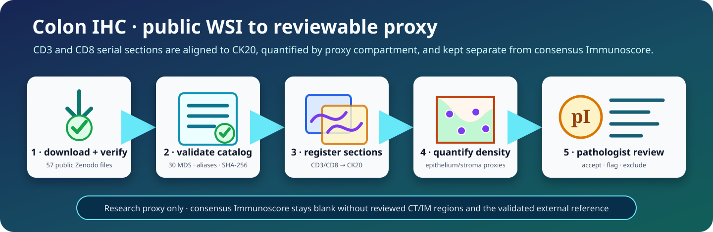

# Colon IHC whole-slide quantification

<div class="tqa-ihc-banner" markdown>
<span class="tqa-kicker">DIRECT MOTIC WSI WORKFLOW</span>

## Register CD3 and CD8 to CK20, then measure compartment densities

TumorQuantAI reads Motic MDS pyramids directly. It creates or preserves stable
non-semantic aliases, aligns serial sections, uses CK20 to form epithelial and
stromal proxies, streams immune-cell detection across each WSI, and writes clear CSV
tables plus visual registration QC.

<a class="tqa-button" href="#reproduce-the-public-analysis">Reproduce the analysis</a>
<a class="tqa-button tqa-button-secondary" href="#review-the-published-output">Review the published output</a>
</div>

<div class="tqa-metric-grid">
  <div class="tqa-metric"><strong>30</strong><span>Motic MDS slides</span></div>
  <div class="tqa-metric"><strong>11</strong><span>public case aliases</span></div>
  <div class="tqa-metric"><strong>9</strong><span>complete CD3/CD8/CK20 sets</span></div>
  <div class="tqa-metric"><strong>0.261780</strong><span>µm/pixel at source level</span></div>
</div>



## Published reference dataset

The exact reference release is public and requires no Zenodo credential:

| Field | Published value |
| --- | --- |
| Dataset | *TumorQuantAI colon cancer CD3, CD8, and CK20 whole-slide image dataset* |
| Record | [`22177196`](https://zenodo.org/records/22177196) |
| DOI | [`10.5281/zenodo.22177196`](https://doi.org/10.5281/zenodo.22177196) |
| Version | `1.0.0` |
| Files | 57 public files; 40,721,516,620 bytes |
| WSIs | 30 sanitized MDS files: 10 CD3, 10 CD8, and 10 CK20 |
| Cases | 11 aliases; 9 complete triplets and 2 explicitly unavailable incomplete cases |
| Rights statement | Copyright (C) 2026 The Authors; public visibility does not itself create a separate open-content license |

The deposit includes the MDS files, exact SHA-256 and MD5 rosters, a
case/slide/marker catalog, the complete TumorQuantAI value and QC CSVs, nine
registration composites, 36 paper-ready review sheets, an HTML report, and an
offline pathologist accept/flag/exclude dashboard. The dataset DOI identifies
this dataset—not the TumorQuantAI software and not a clinically validated
Immunoscore assay.

!!! danger "Research proxy—not clinical Immunoscore"
    This workflow does **not** calculate the clinically validated consensus
    Immunoscore. The required pathologist-reviewed tumour core (CT), invasive
    margin (IM), and validated external reference population are absent.
    TumorQuantAI therefore leaves `consensus_immunoscore` blank and reports its
    status as unavailable. It also emits an explicitly provisional `pI0`–`pI4`
    within-cohort analogue for pathologist accept/flag review. The four density
    measurements, internal percentiles, and pI label are research outputs only.

## What this workflow answers

<div class="tqa-summary-grid">
  <div class="tqa-summary-card" markdown>
  ### Where are CD3/CD8-positive objects?

  CD3 and CD8 WSIs are registered independently to the CK20 serial section.
  Positive-cell centroids are mapped into the common CK20 coordinate space.
  </div>
  <div class="tqa-summary-card" markdown>
  ### Epithelial or stromal proxy?

  Expected-brown CK20 DAB defines an epithelial proxy. Remaining common tissue
  is reported as a stromal proxy. Both masks and every registration require
  visual review.
  </div>
  <div class="tqa-summary-card" markdown>
  ### How dense is the infiltrate?

  TumorQuantAI reports CD3 and CD8 positive-cell counts, analysed area, and
  cells/mm² for each proxy compartment, with automatic QC and auditable
  settings.
  </div>
</div>

## Why this is not the consensus assay

The validated colon-cancer Immunoscore measures CD3 and CD8 cell densities in
the tumour core and invasive margin. The invasive margin is a 720 µm region
centred on the tumour boundary, and four density percentiles are referenced to
a validated 700-case population before they are averaged. Pathologist review
of the tumour and margin regions is part of that process.

This dataset instead contains adjacent CD3, CD8, and CK20 sections. CK20 helps
separate epithelial from non-epithelial tissue, but it does not establish CT
and IM. CK20 expression is linked to epithelial differentiation and can vary
between the tumour centre and leading edge, so it cannot define the entire
invasive boundary. TumorQuantAI makes the distinction explicit:

| Output | Region definition | Reference distribution | Intended use |
| --- | --- | --- | --- |
| Consensus Immunoscore | Pathologist-validated CT and 720 µm IM | Validated external 700-case cohort | Not available here |
| TumorQuantAI CK20-guided proxy | CK20-positive epithelial proxy and CK20-negative common-tissue proxy | This cohort only | Research exploration and QC |
| TumorQuantAI provisional pI0-pI4 | Mean of four CK20-proxy percentiles | Automatic-QC-pass cases in this run | Prioritize pathologist accept/flag review only |

See the consensus validation
[in *The Lancet*](https://doi.org/10.1016/S0140-6736(18)30789-X),
the [analytical validation protocol](https://pmc.ncbi.nlm.nih.gov/articles/PMC7253006/),
the [CK20 spatial-expression caveat](https://pmc.ncbi.nlm.nih.gov/articles/PMC4128715/),
and the [VALIS serial-WSI registration paper](https://doi.org/10.1038/s41467-023-40218-9).

## Install

```bash
git clone https://github.com/cfarkas/tumorquantai.git
cd tumorquantai

./tumorquantai install --conda
export PATH="$HOME/.local/bin:$PATH"

tumorquantai --inmunoscore --help
```

The command is package-native and does not invoke HistoPLUS or Nextflow.
`tumorquantai ihc immunoscore` is the canonical subcommand;
`tumorquantai --inmunoscore` is the requested top-level compatibility form.


## Reproduce the public analysis

The public route consumes the flat Zenodo MDS filenames and the published
`tumorquantai_colon_immunoscore_slide_catalog.csv` directly. It preserves the
published `TQA_CI_...` case aliases, requires no alias secret, and creates no
private linkage table.

### 1. Download all 57 files

The release is 40.7 GB. Keep it outside the Git checkout and allow enough
additional space for a fresh result directory. The following resumable command
uses the Zenodo API only to obtain the fixed filenames and public content URLs:

```bash
TQA_PUBLIC="$HOME/tumorquantai-data/colon-ihc-v1.0.0"
install -d "$TQA_PUBLIC"

curl -fsSL --retry 5 https://zenodo.org/api/records/22177196 \
  | jq -r '.files[] | "\(.links.self)\n  out=\(.key)"' \
  | aria2c --input-file=- \
      --dir="$TQA_PUBLIC" \
      --continue=true \
      --max-concurrent-downloads=3 \
      --max-connection-per-server=1 \
      --auto-file-renaming=false \
      --allow-overwrite=true
```

The command was tested against the published endpoint and preserves each
Zenodo filename. Rerunning it resumes partial transfers. `jq` and `aria2c` must
be installed by the operating system; neither is a TumorQuantAI runtime
dependency.

### 2. Verify the immutable payload

Verify the primary SHA-256 roster before opening or analysing the images:

```bash
(cd "$TQA_PUBLIC" && sha256sum --check SHA256SUMS)

find "$TQA_PUBLIC" -maxdepth 1 -type f -name 'TQA_CIS_*.mds' | wc -l
# Expected: 30
```

`SHA256SUMS` covers the other 55 release files; the two checksum rosters do not
hash themselves. `MD5SUMS` is supplied for repository interoperability and can
be checked separately with `md5sum --check MD5SUMS`. SHA-256 is the primary
integrity check.

### 3. Preview the public catalog

```bash
TQA_RESULTS="$HOME/tumorquantai-results/colon-ihc-v1.0.0-reproduction"

tumorquantai --inmunoscore "$TQA_PUBLIC" \
  --output "$TQA_RESULTS" \
  --public-slide-catalog \
    "$TQA_PUBLIC/tumorquantai_colon_immunoscore_slide_catalog.csv" \
  --workers 3 \
  --dry-run
```

For the published catalog, the preview must report:

```text
input_identity_mode: published_public_slide_catalog
discovered_slide_count: 30
discovered_case_count: 11
complete_case_count: 9
incomplete_case_count: 2
marker_slide_counts: CD3=10, CD8=10, CK20=10
source_mpp_values: [0.26178]
```

The fail-closed reader checks the exact catalog columns, alias shapes, one
slide per case/marker, safe flat filenames, byte sizes, physical scale, source
format, sanitization profile, and equality between the catalog and input MDS
rosters. `--dry-run` does not hash image payloads or create output.

### 4. Quantify from the public MDS files

After the preview matches, remove only `--dry-run`:

```bash
tumorquantai --inmunoscore "$TQA_PUBLIC" \
  --output "$TQA_RESULTS" \
  --public-slide-catalog \
    "$TQA_PUBLIC/tumorquantai_colon_immunoscore_slide_catalog.csv" \
  --workers 3
```

Before case analysis, TumorQuantAI hashes every catalogued MDS and requires its
size and SHA-256 to match the publication catalog. The run is resumable and
writes new results outside the downloaded release. Do not point `--output` at
the Zenodo directory.

## Review the published output

You do not need to rerun 30 WSIs to inspect the reference predictions. Expand
the deposited paper figures beside the self-contained dashboards:

```bash
(cd "$TQA_PUBLIC" && unzip -q -o tumorquantai_immunoscore_paper_figures.zip)
(cd "$TQA_PUBLIC" && python3 -m http.server 8000 --bind 127.0.0.1)
```

Open `http://127.0.0.1:8000/REPORT.html` for the frozen cohort report and
`http://127.0.0.1:8000/PATHOLOGIST_REVIEW.html` for case adjudication. The
dashboard displays the case sheet from the extracted `cases/` tree, falls back
to the deposited registration composite when necessary, preserves all
TumorQuantAI fields, and exports `pathologist_review_completed.csv` with
additive `accept`, `flag`, or `exclude` decisions.

!!! warning "Treat completed review exports as controlled research records"
    The blank deposited dashboard is public, but reviewer codes, free-text
    notes, and downstream annotations can introduce sensitive or identifying
    content. Inspect a completed export before sharing it.

### Published result snapshot

| Cohort result | Published value |
| --- | ---: |
| Automatic-QC pass | 6 cases |
| Automatic-QC review | 3 cases |
| Unavailable incomplete marker set | 2 cases |
| Provisional pI distribution | pI0: 3; pI1: 0; pI2: 4; pI3: 2; pI4: 0; unscored: 2 |
| Consensus Immunoscore | 0 reported; blank with explicit unavailable status for all 11 cases |

The nine numerically available cases have these deposited CK20-proxy density
summaries:

| Measurement | Median positive cells/mm² | Range |
| --- | ---: | ---: |
| CD3, CK20-epithelium proxy | 86.46 | 11.25–3,363.76 |
| CD3, CK20-stroma proxy | 107.85 | 22.02–411.68 |
| CD8, CK20-epithelium proxy | 58.86 | 5.57–3,986.58 |
| CD8, CK20-stroma proxy | 68.42 | 6.14–152.66 |

These are descriptive values from the published
[`cohort_density_summary.csv`](https://zenodo.org/records/22177196/files/cohort_density_summary.csv?download=1),
not estimates of clinical performance. The pI distribution is cohort-relative
and must be interpreted only after reviewing registration, CK20 compartment
assignment, stain quality, tissue coverage, and cell segmentation.

## Analyze private source bundles

Keep original archives, extracted scanner bundles, alias secrets, and linkage
tables outside Git:

```text
controlled-colon-ihc/
├── archives/                         # original ZIPs
├── private_source/
│   └── extracted/inmunoscore/
│       └── <private-case>-CD3-.../
│           ├── 1.mds
│           └── info.ini
├── private_release/
│   ├── alias_secret.bin              # mode 0600, at least 32 random bytes
│   └── case_slide_linkage.csv         # created by the run; mode 0600
└── results/
```

Create the one-time secret without printing it:

```bash
install -d -m 700 /controlled/colon-ihc/private_release
head -c 32 /dev/urandom > /controlled/colon-ihc/private_release/alias_secret.bin
chmod 600 /controlled/colon-ihc/private_release/alias_secret.bin
```

Do not regenerate this file between runs. The same secret and source IDs
produce the same aliases; another secret produces unrelated aliases.

## How cases are linked

TumorQuantAI does not infer case identity from staining intensity, filenames
that merely look similar, or pathologist values. It uses an exact rule:

1. The immediate bundle name must match
   `<source-case-id>-CD3|CD8|CK20-<scanner-suffix>`.
2. The exact text before the marker token is the private case ID.
3. HMAC-SHA-256 with the owner-controlled secret creates one
   `TQA_CI_...` case alias.
4. The complete bundle name independently creates a `TQA_CIS_...` slide alias.
5. A source case may have at most one slide for each marker.

The controlled CSV records the complete evidence chain:

```text
case_alias
slide_alias
source_case_id
source_slide_id
marker
source_mds_path
source_mds_size_bytes
source_mds_sha256
```

Only `case_alias`, `slide_alias`, marker, and non-identifying acquisition facts
appear in public results. The private linkage is required for exact audit and
must never be uploaded to Zenodo or committed to Git.

## Run a private cohort

Set paths once:

```bash
TQA_MDS=/controlled/colon-ihc/private_source/extracted/inmunoscore
TQA_RESULTS=/controlled/colon-ihc/results/tumorquantai_immunoscore
TQA_SECRET=/controlled/colon-ihc/private_release/alias_secret.bin
TQA_LINKAGE=/controlled/colon-ihc/private_release/case_slide_linkage.csv
```

### 1. Inventory-only preview

```bash
tumorquantai --inmunoscore "$TQA_MDS" \
  --output "$TQA_RESULTS" \
  --alias-secret-file "$TQA_SECRET" \
  --private-linkage "$TQA_LINKAGE" \
  --workers 3 \
  --dry-run
```

The preview reads the private Motic `info.ini` scale and reports complete and
incomplete marker sets. It does not hash WSIs, create linkage, or write output.

### 2. Quantify

Remove only `--dry-run`:

```bash
tumorquantai --inmunoscore "$TQA_MDS" \
  --output "$TQA_RESULTS" \
  --alias-secret-file "$TQA_SECRET" \
  --private-linkage "$TQA_LINKAGE" \
  --workers 3
```

The run is resumable by default. It verifies the exact private linkage before
reusing a completed case and refuses a non-empty foreign output directory.
Use `--no-resume` only when intentionally starting with a new empty output.

## What TumorQuantAI does

<div class="tqa-run-strip">
<span><strong>Read</strong> DSI0 pixels only</span>
<span><strong>Register</strong> CD3/CD8 → CK20</span>
<span><strong>Segment</strong> expected-brown H–DAB objects</span>
<span><strong>Report</strong> counts, area, cells/mm², QC</span>
</div>

### 1. Read the Motic pyramid safely

The package opens only `DSI0` pixel tile streams from each MDS compound file.
Label, macro, and acquisition streams are inaccessible to the quantifier.
Physical scale comes from the private Motic `info.ini`; an optional
`--source-mpp` assertion must agree with it exactly.

The analysis level nearest 0.55 µm/pixel is selected by default. For scans at
0.261780 µm/pixel this is the 0.5 pyramid level, 0.523560 µm/pixel.

### 2. Register serial sections

Bounded overviews are formed from DSI0 tiles. SIFT and ORB feature candidates,
partial/full affine transforms, and a tissue-bounding-box fallback are scored
by tissue Dice. The best geometrically valid transform is retained. A Dice
below `--minimum-registration-dice` never becomes a silent zero; it produces a
review status. The feature-free tissue-bounding-box fallback is also always
review-only, even when its global tissue Dice is high.

### 3. Form CK20-guided proxy compartments

Direct stain separation on a 2048-pixel WSI overview can average focal brown
glands into the background. TumorQuantAI therefore streams the CK20 pyramid at
the level nearest 2.0 µm/pixel (2.094240 µm/pixel for this cohort), performs
colour-checked H–DAB separation in each block, and area-projects the fraction
of expected-brown pixels into the bounded registration overview. An overview
pixel enters the raw proxy when at least 2% of its contributing fine pixels
pass the 0.08 DAB-OD threshold.

Connected regions smaller than 1,000 µm² are removed, subject to a four-pixel
minimum at the realised overview resolution. Retained regions are closed and
expanded by 8 µm to form `ck20_epithelium_proxy`; common registered tissue
outside the mask is `ck20_stroma_proxy`. Pyramid coordinates are converted by
their numeric level scale and the explicit overview resize—not by padded tile
canvas ratios. This matters because MDS levels can have different amounts of
white edge padding.

Every `measurement.json` records the selected CK20 level, realised µm/pixel,
block counts, fine-pixel DAB fraction, projected-fraction threshold and range,
raw/final compartment fractions, overview scale, and effective morphology.
Treat these assignments as coarse CK20-guided WSI compartments, not
cellular-resolution tumour or invasive-margin annotations.

### 4. Stream CD3/CD8 object detection

Each immune WSI is processed in bounded blocks, so the full 100,000-pixel-scale
image is never materialized in memory. Counterstained and DAB-positive objects
are watershed-segmented. A 3 µm expanded-cell region is positive when either:

```text
mean expected-brown DAB OD ≥ 0.16
OR
at least 8% of expanded-cell pixels have DAB OD ≥ 0.16
```

An 8 µm strip is excluded at block boundaries from cell centres and the
corresponding analysed footprint to reduce clipped/duplicate objects.
A marker with no segmented nuclei remains numerically auditable but is forced
to review status; it cannot enter the pass-only cohort statistics or ranks.

### 5. Map and quantify

Every retained centroid is transformed from the immune analysis level through
the moving overview into CK20 coordinates. This transform uses the numeric MDS
pyramid scale plus any explicit overview resize so differing tile padding does
not shift cells. Counts are divided by the matching common-tissue compartment
area:

```text
positive-cell density = mapped positive cells / analysed compartment area (mm²)
```

The four headline TumorQuantAI values are:

```text
tumorquantai_cd3_ck20_epithelium_density_per_mm2
tumorquantai_cd3_ck20_stroma_density_per_mm2
tumorquantai_cd8_ck20_epithelium_density_per_mm2
tumorquantai_cd8_ck20_stroma_density_per_mm2
```

### 6. Generate a provisional score without impersonating validation

Automatic-QC-pass cases define four deterministic mid-rank reference
distributions. Every numerically available pass or review case is placed
against those references. TumorQuantAI averages its four percentiles and emits:

```text
pI0   0–10
pI1  >10–25
pI2  >25–70
pI3  >70–95
pI4  >95–100
```

The bands mirror the published five-category percentile presentation, but the
mandatory `p` prefix marks a different, provisional calculation: CK20
epithelium/stroma substitutes for CT/IM, and this small internal cohort
substitutes for the validated external distribution. Review cases can receive a
pI value so the pathologist can accept or flag the technical result, but they
never contribute to the reference. `consensus_immunoscore` remains blank.

### 7. Build paper-ready review sheets

TumorQuantAI writes a 300-dpi case summary plus one PNG/PDF/legend triplet for
each CK20, CD3, and CD8 WSI. The layout follows the useful conventions of WSI
plotters such as LazySlide: clean overview panels, explicit overlays, physical
scale bars, and export-resolution metadata. It adds the exact four density
values, a pI gauge, and QC flags required for this workflow.
See LazySlide's [WSI visualization guide](https://lazyslide.readthedocs.io/en/stable/tutorials/visualization.html)
and [publication-quality export guidance](https://lazyslide.readthedocs.io/en/latest/how-to/visualization.html)
for the visual conventions; TumorQuantAI's renderer is independent and adds no
LazySlide runtime dependency.

The immune panels are registration blends at overview scale. They are not
cell-outline overlays. Open the source WSI at cellular resolution whenever
segmentation itself is in question.

## Review a new local run

Open:

```text
results/tumorquantai_immunoscore/START_HERE.html
```

Review in this order:

1. Confirm the expected complete and incomplete marker sets.
2. Open every `registration_qc.png`.
3. Reject or correct implausible serial-section registration.
4. Review the CK20 epithelial proxy across both tumour centre and leading edge.
5. Check analysed area and mapped-positive-cell fraction.
6. Open `PATHOLOGIST_REVIEW.html`, inspect the 300-dpi paper sheet, and choose
   `accept`, `flag`, or `exclude`.
7. Export `pathologist_review_completed.csv`; preserve the original prediction
   and automatic-QC columns unchanged.
8. Only then interpret the reviewed density and provisional-score tables.

The output map is:

```text
tumorquantai_immunoscore/
├── START_HERE.html
├── PATHOLOGIST_REVIEW.html
├── cases/<case_alias>/
│   ├── measurement.json
│   ├── registration_qc.png
│   └── paper_figures/
│       ├── case_summary_paper_figure.{png,pdf}
│       ├── case_summary_paper_figure_legend.txt
│       └── <slide_alias>_<marker>_paper_figure.{png,pdf}
├── tables/
│   ├── public_slide_inventory.csv
│   ├── tumorquantai_immunoscore_values.csv
│   ├── cohort_density_summary.csv
│   ├── case_compartment_densities.csv
│   ├── registration_qc.csv
│   ├── paper_figure_manifest.csv
│   ├── pathologist_review_template.csv
│   ├── pathologist_review_codebook.csv
│   └── unavailable_cases.csv
└── workflow_metadata/
    ├── immunoscore_run.json
    └── failures.json                    # only when a case failed
```

### What the numbers mean

| File | Use it for | Important boundary |
| --- | --- | --- |
| `tumorquantai_immunoscore_values.csv` | One row per public case alias, four densities, internal percentiles, pI0-pI4, and explicit consensus-unavailable fields | Review cases are scored against—but never included in—the automatic-pass reference |
| `cohort_density_summary.csv` | Mean, sample SD, median, quartiles, and range for each density under pass-only and all-numeric populations | Population and `n` are explicit; review cases never silently enter pass-only statistics |
| `case_compartment_densities.csv` | Counts, areas, densities, mapping fraction, MPP, and QC in long format | A technically completed row can still require review |
| `registration_qc.csv` | Transform method, feature matches, inliers, tissue Dice, and affine matrix | Automated Dice does not replace visual review |
| `paper_figure_manifest.csv` | Every 300-dpi case/slide PNG, PDF, legend, and layout version | Overview-scale figures do not prove cell-level segmentation accuracy |
| `pathologist_review_template.csv` | Blank accept/flag/exclude adjudication fields beside immutable algorithm outputs | Exported review must retain reviewer code and timestamp; it never overwrites predictions |
| `unavailable_cases.csv` | Missing-marker and failed-case audit | Missing is never encoded as biological zero |

## Zenodo privacy boundary

The release workflow creates new MDS files under non-semantic HMAC-derived
slide aliases. It
preserves every DSI0 pixel stream byte-for-byte and replaces all label, macro,
and non-pixel OLE streams with deterministic same-size generic neutral content.
The replacement payload never repeats a source stream name. Each staged file
is then checked for:

- exact DSI0 stream names and bytes;
- full and sampled DSI0 fingerprints;
- deterministic non-pixel replacement;
- absence of case and bundle-name variants in UTF-8, Latin-1, UTF-16LE, and
  UTF-16BE;
- decodability and pyramid geometry;
- visual tissue-pixel review.

The original ZIPs, sidecars, source filenames, alias secret, private linkage,
and private sanitizer mapping remain outside the deposit. The package release
helper can create only a restricted, unsubmitted Zenodo draft; it contains no
publication action. For reference release `1.0.0`, the owner separately
completed the privacy, integrity, visual, rights, and metadata gate, published
the record, and explicitly changed all 57 files to public visibility. That
manual action produced DOI
[`10.5281/zenodo.22177196`](https://doi.org/10.5281/zenodo.22177196); it is not
performed by TumorQuantAI.

Non-semantic public aliases and sanitized container metadata do not justify
attempting re-identification from tissue pixels or combining the images with
outside identifying data.

## Limitations to carry into every report

- Serial sections are not cell-for-cell identical.
- CK20 is an epithelial aid, not a complete colorectal tumour-boundary marker.
- The DAB thresholds are deterministic research settings, not assay
  calibration.
- Automatic tissue Dice can miss local misregistration.
- No tumour core or invasive margin has been reviewed.
- Internal ranks are cohort-relative and will change with cohort composition.
- Outputs must not guide patient care.

For the exact CLI contract and CSV schemas, see
[CK20-guided CD3/CD8 reference](../reference/colon-ihc-immunoscore.md).
